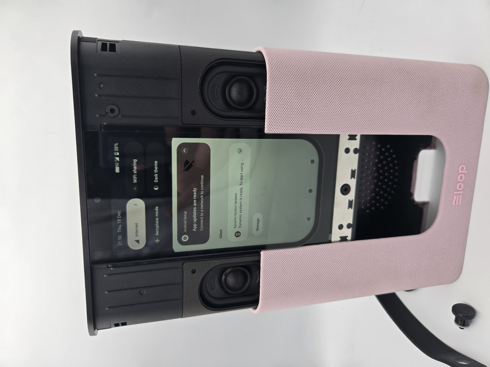
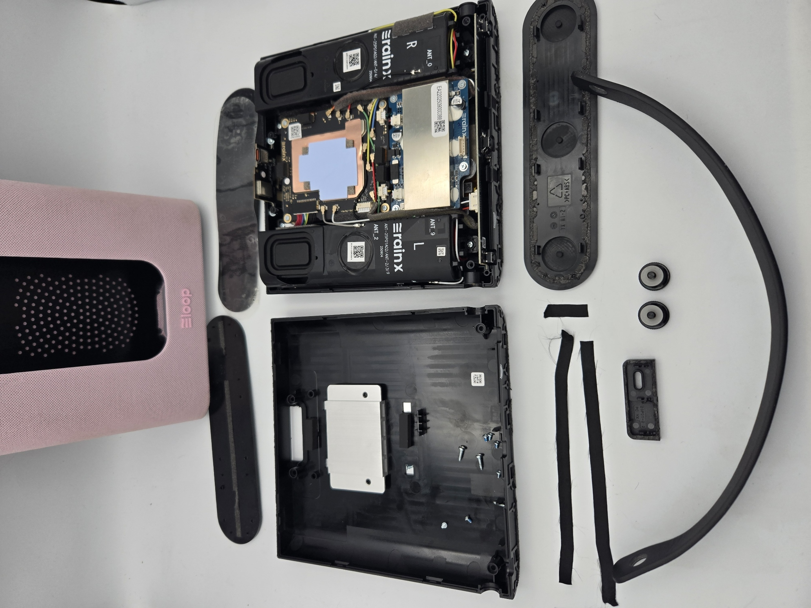
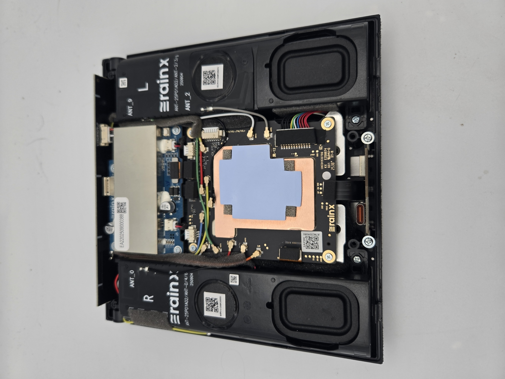

# LoopDL Speaker Teardown

    
  
  
  

This repository documents my teardown of the **LoopDL** (also known as Loop DL), a subsidized 5G smart speaker launched for £1 (now £95) in the UK. It runs Android 15 with built-in cellular connectivity via eSIM.

## Hardware Overview

The [images](https://github.com/flip555/loopdl/tree/main/images) folder contains photos of the full disassembly process in approximate order:

- External views and initial opening
- Speakers
- Main board with SoC
- Battery

(Preview image above is resized for better README viewing – click it to see full resolution. All photos are available in full size in the `/images/` folder.)

### Identified Components

- **SoC**: MediaTek MT6877V (Dimensity series, supports 5G)
- **Battery**: Model U497082PV – 4250mAh / 32.73Wh, 7.7V nominal (8.8V charging limit), manufactured by Shenzhen Utility Energy Co., Ltd. (Production date: October 2025)
- **eSIM**: Integrated eUICC chip (two profiles: bootstrapping/"Rain" simulation from China Mobile HK, and operational Gamma/Three UK profile)

## Rooting the Device

Thanks to these excellent community guides:

- [robyn.zip – Rooting a 5G speaker I got for £1](https://robyn.zip/posts/2025-12-loop-speaker/) – Detailed step-by-step guide using DSU Sideloader, GSI, and Magisk patching
- [daveio/loop wiki](https://github.com/daveio/loop/wiki) – Early hardware analysis and rooting information

The typical process involves unlocking the bootloader, sideloading a Generic System Image (GSI) temporarily, pulling boot partitions, patching with Magisk, and flashing back.

## Managing eSIM (Disabling/Enabling the "Rain" Simulation Profile)

The LoopDL ships with two eSIM profiles:

- Bootstrapping/"Rain" simulation profile (China Mobile HK – provides free data, often routes through South Africa)
- Operational Gamma/Three UK profile (£25/mo plan) - Installed via LoopDL activating (Scanning QR etc)

Normally, the "Rain" profile is automatically disabled once the Gamma/Three profile is activated. After rooting, you can regain full control:

1. Install the **OpenEUICC** Magisk module.
2. Reboot and open the OpenEUICC app.
3. Both profiles will be listed (you can also enable Dual SIM mode from the top menu if supported).
4. Disable or delete the Gamma/Three UK profile if desired.
5. Re-enable the China Mobile HK "Rain" profile – it provides free? internet access, with traffic routing through South Africa.

## Useful Links & Resources

- **Magisk** (root solution): [Official GitHub Repo](https://github.com/topjohnwu/Magisk)
- **OpenEUICC** (eSIM management Magisk module): [AndroPlus-org/magisk-module-openeuicc](https://github.com/AndroPlus-org/magisk-module-openeuicc/releases/tag/v4) – Use the archived v4 release (proven to work on LoopDL)
- **DSU Sideloader** (used in rooting guides): [GitHub Repo](https://github.com/VegaBobo/DSU-Sideloader)

## Future Ideas

- Explore **WebADB**-based rooting workflows (browser-based ADB via WebUSB for easier access without a full PC setup).
  
Contributions are very welcome! Open issues for part identifications, additional photos, or guide improvements.
